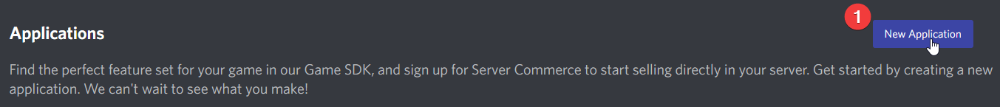
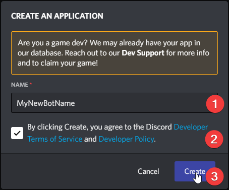
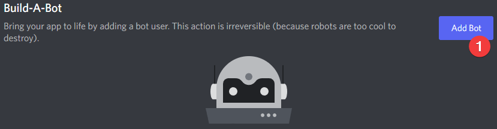
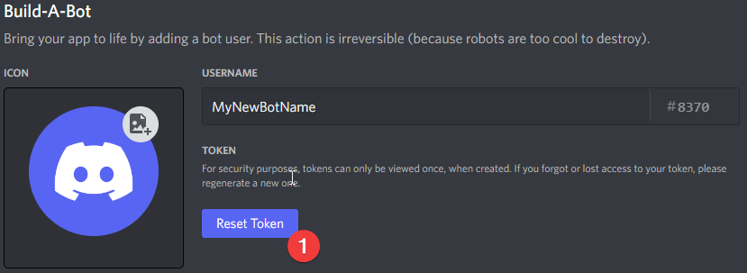
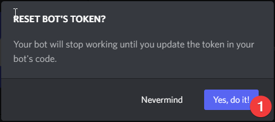
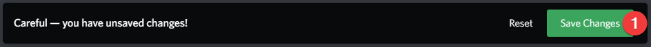
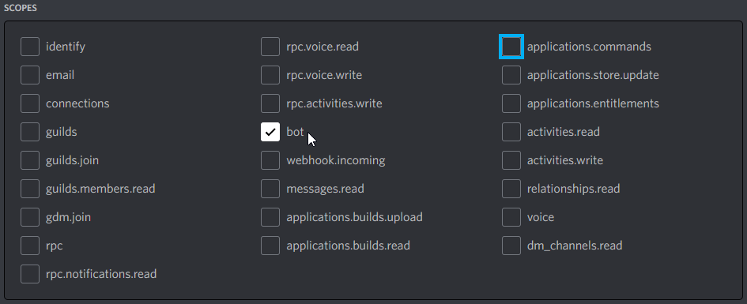
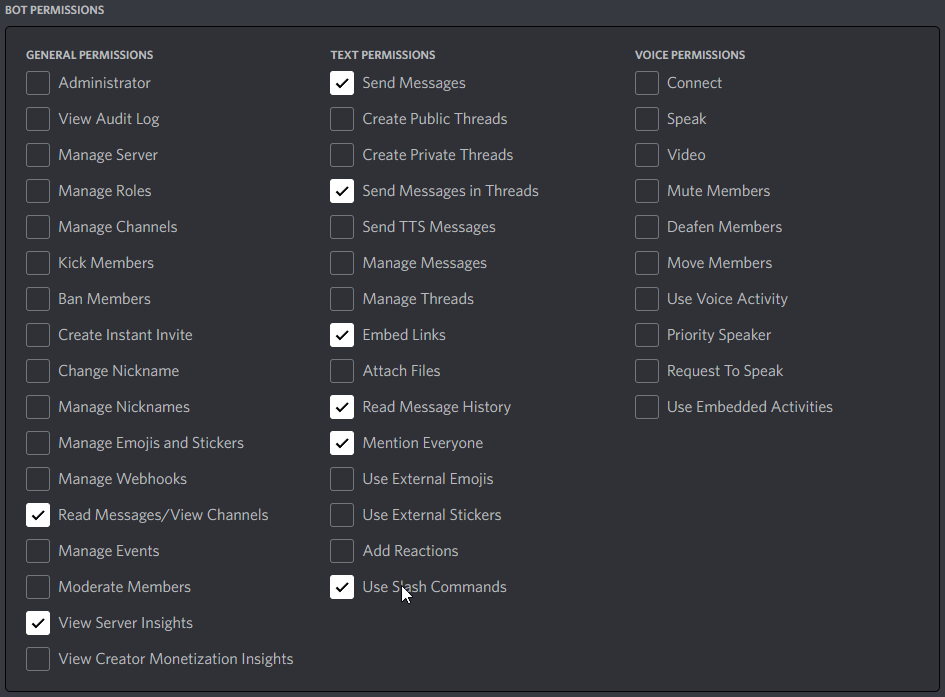
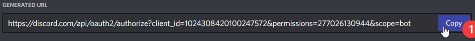

# How To Create a Discord Bot
This bot is designed to be used in one server/guild at a time. As a result, you
will need to create a discord bot first.

## Creating a Discord Bot
1. Log into the [Discord Website](https://www.discord.com/)
1. Navigate to the [application page](https://discord.com/developers/applications)
1. In the top right, click the New Application button:  
   
1. Give the application a name, check the box to agree with the Terms of 
   Service and Developer Policy, then click the Create button:  
   
1. Click on the Bot tab once the application is created:  
   
1. Click the Add Bot button:  
   
1. Click the button that says Yes, do it!:  
   
1. Click the button to reset your bot token:  
   
1. Confirm resetting the bot token:  
   
1. Copy the token and save it somewhere safe. This token will not be displayed
   again. If you lose this token, you will need to reset it to a new token and
   replace it in your bot again. NOTE: The token in the image below is invalid,
   it will not work. You need your own token.  
   
1. Toggle the "Public Bot" option off, the Server Members Intent option on, and
   the Message Content Intent option on:  
   
1. Save your changes!  
   
1. The bot is now created on Discord.

## Inviting The Bot To Your Server
At this point, the bot is created on Discord, but is not on any server. To use 
it, we need to invite it to your server. This requires creating an invite link.

1. Make sure you are still logged into the [Discord Website](https://www.discord.com/)
1. Navigate to the [application page](https://discord.com/developers/applications)
1. Select your bot under My Applications:  
   
1. Click OAuth2:     
   
1. Click URL Generator  
   
1. Under Scope, select the "Bot" option:  
   
1. Under Bot Permissions, select the Read Messages/View Channels, View Server
   Insights, Send Messages, Send Messages in Threads, Embed Links, Read Message
   History, Mention Everyone, and Use Slash Commands permissions:  
   
1. At the bottom of the page under Generated Url, click the Copy button.  
   
   a. NOTE 1: There are serious ramifications of choosing the Administrator
      permission. Please consider carefully if you add it. **This bot does not
      do any server/user management, and does not need the Administrator 
      permission**.
   b. NOTE 2: If your server has the Server-Wide 2FA enabled, then you will 
      need 2FA enable on your own account for certain actions and permissions.
      See the [2FA support page](https://support.discord.com/hc/en-us/articles/219576828-Setting-up-Two-Factor-Authentication) 
      for more information.
1. The resulting URL you just coppied can be used to add your bot to a server.
   Copy and paste the URL into your browser, choose a server to invite the bot 
   to, and then click "Authorize".
   a. NOTE: You will need the "Manage Server" permission on the server you are
      inviting the bot to. If you do not have the Manage Server permission, you
      will be unable to invite the bot to any server.