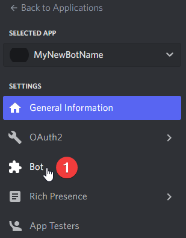
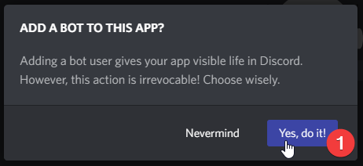
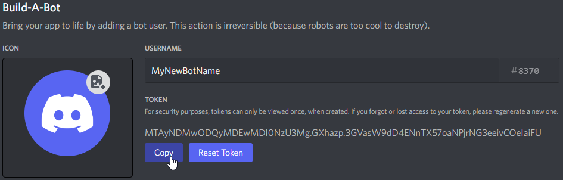
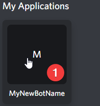
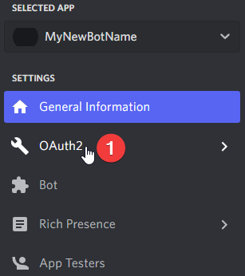
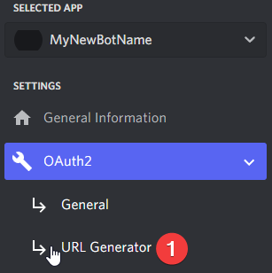

# DiscordIrcBridge
Creates a bridge between Discord and IRC, moving messages back and forth between them.

## Installation

### Creating a Discord Bot
This bot is designed to be used in one server/guild at a time. As a result, you will need to create a discord bot first.

1. Log into the [Discord Website](https://www.discord.com/)
1. Navigate to the [application page](https://discord.com/developers/applications)
1. In the top right, click the New Application button:
   
1. Give the application a name, check the box to agree with the Terms of Service and Developer Policy, then click the Create button:
   
1. Click on the Bot tab once the application is created:
   
1. Click the Add Bot button:
   
1. Click the button that says Yes, do it!:
   
1. Click the button to reset your bot token:
   
1. Confirm resetting the bot token:
   
1. Copy the token and save it somewhere safe. This token will not be displayed again. If you lose this token, you will need to reset it to a new token and replace it in your bot again. NOTE: The token in the image below is invalid, it will not work. You need your own token.
   
1. Toggle the "Public Bot" option off, the Server Members Intent option on, and the Message Content Intent option on:
   
1. Save your changes!
   
1. The bot is now created on Discord.

### Inviting The Bot To Your Server
At this point, the bot is created on Discord, but is not on any server. To use it, we need to invite it to your server. This requires creating an invite link.

1. Make sure you are still logged into the [Discord Website](https://www.discord.com/)
1. Navigate to the [application page](https://discord.com/developers/applications)
1. Select your bot under My Applications:
   
1. Click OAuth2:   
   
1. Click URL Generator
   
1. Under Scope, select the "Bot" option:
   
1. Under Bot Permissions, select the Read Messages/View Channels, View Server Insights, Send Messages, Send Messages in Threads, Embed Links, Read Message History, Mention Everyone, and Use Slash Commands permissions:
   
1. At the bottom of the page under Generated Url, click the Copy button.
   
   a. NOTE 1: There are serious ramifications of choosing the Administrator permission. Please consider carefully if you add it. **This bot does not do any server/user management, and does not need the Administrator permission**.
   b. NOTE 2: If your server has the Server-Wide 2FA enabled, then you will need 2FA enable on your own account for certain actions and permissions. See the [2FA support page](https://support.discord.com/hc/en-us/articles/219576828-Setting-up-Two-Factor-Authentication) for more information.
1. The resulting URL you just coppied can be used to add your bot to a server. Copy and paste the URL into your browser, choose a server to invite the bot to, and then click "Authorize".
   a. NOTE: You will need the "Manage Server" permission on the server you are inviting the bot to. If you do not have the Manage Server permission, you will be unable to invite the bot to any server.

### Running The Bot
By now, you have created the bot on Discord, and invited it to the server. However, the bot is not actually running! To run the bot, you will need to run the code. You can do this via one of multiple methods:
#### Running in Docker-Compose
The easiest way to run the bot on docker is with Docker-Compose. Installing and configuring docker-compose is outside the scope of these instructions. You can find help on that topic at the [docker-compose page](https://docs.docker.com/compose/).
1. Copy the docker-compose.yml from the Docker directory to a directory locally.
1. Copy the .env file from the Docker directory to the same directory as docker-compose.yml.
1. Edit the .env file and add in the Bot Token that you copied in Step 10 of Creating a Discord Bot above. Your final file will look something like:
   ```
   DISCORD_GUILDID=293879474672106934
   DISCORD_TOKEN=MTayNDMwODQyMDEwMDIONzU3Mg.GXhazp.3GVasW9dD4ENnTX57oaNPjrNG3eeivCOelaiFU
   DISCORD_COMMANDPREFIX=!
   ```
   a. NOTE: the Guild ID and Token above are for example purposes only. You need to substitute in your own guild id and bot token.
1. From the directory that the docker-compose.yml and .env file are in, run "docker-compose up"
1. The bot should now be running and listening in your server.
#### Running in Docker without Docker-Compose
The bot requires one volume mounted in /data and you will need to provide three environment variables the first time you run it so that it knows what guild to initialize and what token to authorize with.
You can use a command similar to below:
  ```
  docker run -d -t- i \
  -e DISCORD_GUILDID=293879474672106934 \
  -e DISCORD_TOKEN=MTayNDMwODQyMDEwMDIONzU3Mg.GXhazp.3GVasW9dD4ENnTX57oaNPjrNG3eeivCOelaiFU \
  -e DISCORD_COMMANDPREFIX=! \
  -v data:/data
  -name discordircbridge sblomfield/discordircbridge

  ```
  a. NOTE: the Guild ID and Token above are for example purposes only. You need to substitute in your own guild id and bot token.
#### Running from an executable on your PC
No executable files are published for installation, however the source code is available and you are encouraged to clone the repository and build the code yourself. The code requires .NET 7.0 and Visual Studio 2022 Preview. The code will expect a /data/ or C:\data\ directory to be present to store its configuration files.

### Configuring The Bot
#### Adding the IRC Server connection
#### Mapping IRC Channels
#### Mapping Discord/IRC Users

### Commands
#### Bridge Commands
#### Channel Commands
#### User Commands
#### Info Commands

### Configuration Files
The bot will store its configuration files in /data or C:\data (depending on UNIX or Windows)
####discord.json
Stores information about its Discord connection including Server/Guild Id, and Bot Token.
####irc.json
Stores information about its IRC connection
####mapping.json
Stores information about which discord channels are mapped to which IRC channels, as well as what Discord usernames are mapped to a given IRC username.
####statistics.json
Keeps some running statistics about the bot including uptime and messages processed.
####log files
The bot will keep a set of rolling 7 day log files.