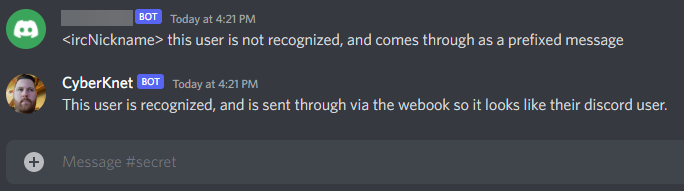

# DiscordIrcBridge
This project creates a bridge between Discord and IRC, orchestrating messages 
back and forth between the two services.

## Installation
Installation consists of creating a bot on the Discord website, running the bot
through docker, and configuring the bot after it is up and running. Depending
on your experience with Discord, Bots, and/or Docker - any of these may be an
easy task for a seasoned pro-user, or daunting as a new experience.

To assist, the following guides have been created broken out by task:
1. [How to create a discord bot](Documentation/HowToCreateADiscordBot.md)
2. [How to run the bot](Documentation/HowToRunTheBot.md)
3. [How to configure the bot](Documentation/HowToConfigureTheBot.md)

## Webhooks
The bot supports using
[Discord Webhooks](https://support.discord.com/hc/en-us/articles/228383668-Intro-to-Webhooks)
to post messages so that they appear to be posted by a mapped discord user for 
each IRC user.  

The default display for an unmapped user has the bot send the text to discord,
prefixed with the user's nickname.

When a webhook is specified for the channel, messages sent by mapped users will
appear on Discord as having been sent by their mapped user id. The message
will be marked with a [bot] tag to differentiate between messages the user
sent on Discord, and messages posted by the bot:  

Note that currently the bot only identifies users by nickname, and does not
take host mask into account. This can lead to messages appearing on Discord
that the "real" IRC user did not send. Using hostmask to consider these is
planned for the future.

Additionally, when a discord user changes their nickname or picture, the
messages posted through the webhook will not be updated.

## Commands
Usage of the bot is thoroughly documented in the 
[Bot Command Reference](Documentation/CommandReference.md).

## Configuration and Logging
Documentation of our configuration and loggile files can be located on the 
[Configuration And Logging](Documentation/ConfigurationAndLogging.md) page.

## Conduct and Contribution
Our project has a [code of conduct](CODE_OF_CONDUCT.md). Because we value
inclusiveness, we require all members of the project and community to adhere
to this code. If you have questions, please contact us as laid out in the
[code of conduct](CODE_OF_CONDUCT.md). 

We welcome contributions from anyone that acknowledges and agrees to the
code of conduct. We look forward to working with you, and to make this easier
we have written up a page that documents how the source code is laid out and
how you can submit your changes on our [how to contribute](Documentation/HowToContribute.md)
page.

## Feedback
This software is still newly created, and you may run into an issue from time
to time. When that happens, what should you do?

If you know how to write code, look and see if you can find the problem. We
have great documentation about how the software works in the 
[How to Contribute](Documentation/HowToContribute.md) section. Even if you
have never submitted a pull request before, don't be discouraged! We will
love to help you through the process.

If you do not know how to write code, you may find yourself in the position
of knowing it isn't working correctly, but not knowing how to fix it yourself.
All is not lost, we still want to hear from you. In order for us to help you,
we ask you to help us - and it's easy to do... just write us a nice github issue.
What do we mean by that?

- Title: Pick a short, quick description of the bug. For example, "IRC actions 
  displaying incorrectly in Discord"
- Consider carefully what someone who can resolve your issue might want to know
  as they try to help you. For example,
  - Description
  - Screenshots
  - Steps to reproduce the problem
  - IRC Network you are connected to
  
  

